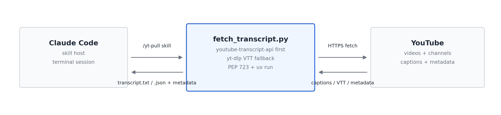

# YT Pull

YouTube transcript extraction and analysis skill for [Claude Code](https://docs.anthropic.com/en/docs/claude-code). Paste a URL, get a structured summary.

  



## What It Does

Pulls YouTube video transcripts and metadata, then generates structured summaries via Claude — all from the terminal. Supports single videos and batch channel mode.

- **Transcript extraction** — structured entries with timestamps, plus clean plain text
- **Metadata fetch** — title, channel, date, duration, views, description
- **Three analysis depths** — brief, standard, deep
- **Channel mode** — list recent videos from a channel, batch-pull transcripts
- **Auto-dependency management** — creates a venv and installs packages automatically
- **No video/audio download** — only subtitles and metadata

## Setup

### Prerequisites

- [uv](https://docs.astral.sh/uv/) — resolves Python 3.10+ and both dependencies automatically from the script's inline (PEP 723) metadata

### As a Claude Code Skill

Copy `SKILL.md` to `~/.claude/skills/yt-pull/SKILL.md` and `fetch_transcript.py` alongside it.

### Standalone Script

```bash
# Fetch transcript + metadata
uv run fetch_transcript.py VIDEO_ID --output-dir ./output

# List channel videos
uv run fetch_transcript.py --channel @ChannelHandle --max-videos 10 --output-dir ./output
```

## Usage

### Single Video

```
/yt-pull https://www.youtube.com/watch?v=dQw4w9WgXcQ
```

Supported URL formats:
- `https://www.youtube.com/watch?v=VIDEO_ID`
- `https://youtu.be/VIDEO_ID`
- Raw 11-character video ID

### Channel Mode

```
/yt-pull --channel @nateherk --max-videos 5
```

Channel input formats:
- `@ChannelHandle`
- `https://www.youtube.com/@ChannelHandle`
- `https://www.youtube.com/c/ChannelName`

### Options

| Flag | Values | Default |
|------|--------|---------|
| `--lang` | Language code (`en`, `es`, `fr`, ...) | `en` |
| `--output` | Output directory path | `./yt-pull` |
| `--depth` | `brief`, `standard`, `deep` | `standard` |
| `--max-videos` | Max videos to list from channel | `10` |

## Output Structure

### Single Video

```
yt-pull/{video-slug}/
├── transcript.txt        # Clean plain text (deduplicated, paragraphed)
├── transcript.json       # Structured [{text, start, duration}, ...]
├── metadata.json         # Title, channel, date, duration, views
└── analysis.md           # AI-generated summary & analysis
```

### Channel Mode

```
yt-pull/{channel-slug}/
├── channel.json          # [{id, title, upload_date, duration, views, url}, ...]
└── {video-slug}/         # One directory per pulled video
    ├── transcript.txt
    ├── transcript.json
    ├── metadata.json
    └── analysis.md
```

## Analysis Depths

**Brief** — 2-3 sentence summary + 3-5 key takeaways

**Standard** — Video info, 1-2 paragraph summary, 5-8 key points, notable quotes, topics covered

**Deep** — Everything in standard, plus: timestamped outline, argument analysis, audience context, related content, critical assessment, action items

## Architecture

Two-file design:

- **`SKILL.md`** — Skill definition with the full execution pipeline (parse input, fetch transcript, spawn analysis subagent, output results)
- **`fetch_transcript.py`** (~370 lines) — Standalone script with PEP 723 inline dependencies, run via `uv run`:
  - Primary transcript method: `youtube-transcript-api` (lightweight, structured timestamps)
  - Fallback: `yt-dlp` with VTT parsing and cleaning
  - Metadata via `yt-dlp --dump-json`
  - Channel video listing via `yt-dlp --flat-playlist`

The skill spawns analysis as a subagent to keep large transcripts out of the main Claude Code context window.

## License

MIT — see [LICENSE](LICENSE).
